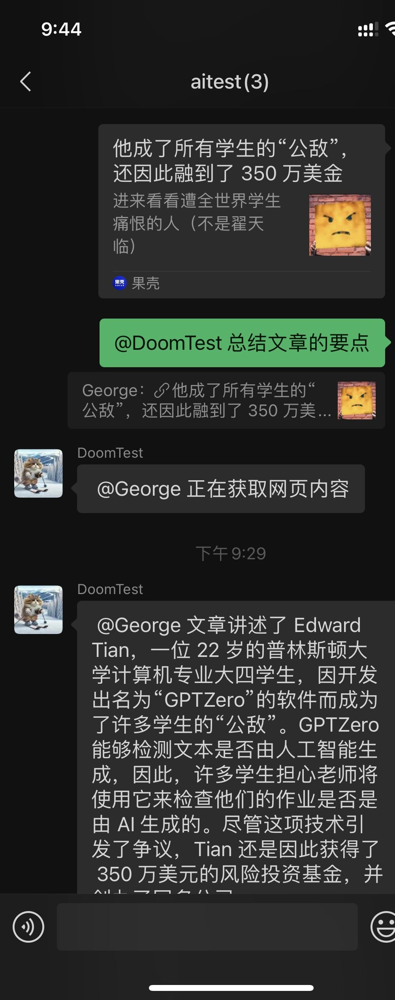
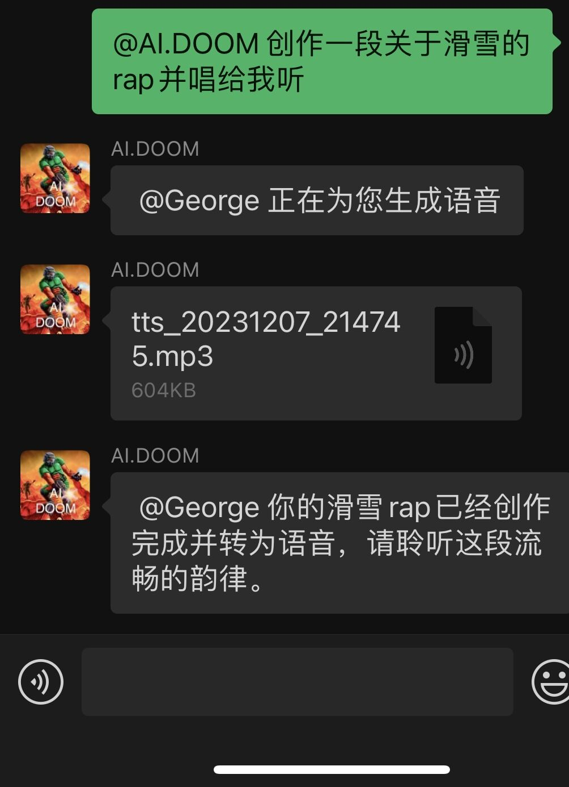

# 微信AI助理 (Wechat AI Assistant)
通过微信 Windows 桌面版接入, 调用 OpenAI Assistant API 处理交互的微信AI助理
## 简介
使用 [WeChatFerry](https://github.com/lich0821/WeChatFerry) 库控制 Windows PC 桌面微信客户端, 访问 OpenAI ChatGPT 会话 / dall-e-3 作图等功能。

特点: 
- 在微信中与 AI 对话, 帮助你完成回答问题、绘图、生成语音、处理文件等任务。
- 利用 Windows 桌面版微信程序登录。
- 使用 OpenAI Assistant API 自动管理对话上下文
- AI 自行判断调用代码解释器和外部函数等工具，实现绘图、 语音、读取链接等功能。

后续计划开发:
- 查阅功能, 使 AI 可以访问和创造文件
- 语音识别
- AI 调用其他工具实现联网, 天气查询等功能

## 使用截图





## 部署说明
部署需要的条件:
1. OpenAI API Key
2. Windows 电脑或服务器
3. (中国国内) 用于访问OpenAI的代理服务器
4. Python 环境 (推荐 Python 3.11)

部署步骤:
1. 安装微信 `3.9.2.23`版本[下载地址](https://github.com/lich0821/WeChatFerry/releases/download/v39.0.7/WeChatSetup-3.9.2.23.exe)
2. 克隆项目代码到本地
```bash
git clone https://github.com/latorc/Wechat-AI-Assistant.git
cd Wechat-AI-Assistant
```
3. (可选) 创建 Python 虚拟环境并激活
```bash
python -m venv .venv
.venv\Scripts\activate.bat
```
4. 安装依赖的库
这里使用清华的来源, 方便中国国内用户快速下载
```bash
pip install -r requirements.txt -i https://pypi.tuna.tsinghua.edu.cn/simple
```
5. 编辑配置文件
重命名配置文件 config_template.yaml 为 config.yaml, 并编辑配置项。

主要配置选项说明如下:
| 配置项 | 说明 | 举例 |
| :--- | :--- | :--- |
| api_key | 你的 OpenAI API Key | sk-abcdefg12345678.... |
| base_url | OpenAI API 的网址, 使用默认 API 无需改动 | https://api.openai.com/v1 |
| proxy | 代理服务器地址, 格式为"http://地址:端口号" | http://10.0.0.10:8002 |
| chat_model | 默认使用的聊天模型 | gpt-4-1106-preview |
| admins | 管理员微信号列表, 只有管理员可以使用管理员命令 | [wx1234, wx2345] |

其他配置选项请参见 config.yaml 中的注释。

6. 运行 main.py
```bash
python main.py
```
程序会自动唤起微信客户端, 之后扫码登录微信桌面客户端，即可开始使用。

## 使用提示
添加微信AI助理的微信好友, 或将其加入群聊中并@它, 与它进行对话。
直接与其对话将调用 ChatGPT 进行回答。
微信AI助理会根据用户的文本, 自主选择调用工具完成任务。现阶段工具包括绘图(OpenAI dall-e-3), 代码解释器, 合成语音(OpenAI API), 访问网页链接等。
- "画一张猫滑雪的写真照片"
- "创作一段关于滑雪的说唱并唱给我听"

可以引用微信消息, 让AI助理处理。
例如: 
- 引用图片消息 "将图片转化成灰度"
- 引用公众号文章 "帮我总结一下文章要点"


一些其他技巧和提示:
1. 可以使用手机模拟器 (如逍遥模拟器) 登录微信, 并登录 Windows 微信客户端, 即可保持微信持续在线。
2. 一站式解决 API Key 注册充值和中国境内连接 OpenAI API 的问题，推荐使用服务:
   
   [Next API中转服务](https://api.nextweb.fun)

   可以在线支付和在中国连接的 OpenAI API 服务
