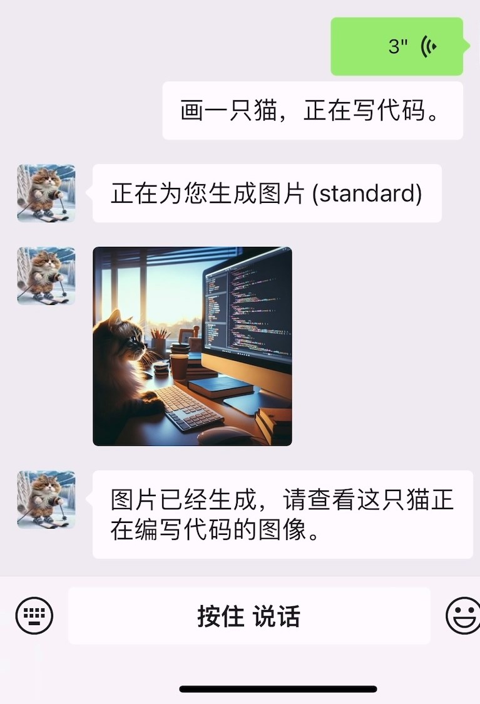

# 微信 AI 助理 (Wechat AI Assistant)
在微信中与 ChatGPT AI 助理进行多模态交互, 处理问答、扮演角色、响应语音消息、分析图片和视频、总结文章和网页链接、搜索互联网等等。
## 简介
本项目使用 <a href="https://github.com/lich0821/WeChatFerry" target="_blank">WeChatFerry</a> 库控制 Windows PC 桌面微信客户端, 调用 OpenAI Assistant API 进行智能多模态消息处理。 
- 在微信中与 ChatGPT AI 对话（文字或语音），进行多模态交互。
- 使用 WeChatFerry 接入 Windows 桌面版微信, 对微信的兼容性高(无需实名认证), 风险低。
- 使用 OpenAI Assistant API 自动管理群聊对话上下文。
- AI 自行判断调用代码解释器和外部工具完成任务。现有工具: bing_search (必应搜索), browse_link (浏览网页链接), image_to_text (图像转文字描述), text_to_image (文字描述作图), text_to_speech (文本转语音), video_analysis (视频分析)等
- 后续计划开发: 上传文件, 使 AI 能引用文件内容 (知识库) / AI 调用其他 API / 企业微信和微信公众号登录
- QQ群: 812016253 [点击加入](https://qm.qq.com/cgi-bin/qm/qr?k=CD7LTR5YAkS-VHtG5MDljRJdpbqzCsS4&jump_from=webapi&authKey=rqQ1ihDTpsyiegPfXkYoxcloXQUQp6EhG2xwWhtTP/Hh9EbRaPQ8I/2QCPbgQ8F4)

## 使用案例
- "画一张猫和水豚一起滑雪的照片"
- "(引用图片) 根据图片内容作一首诗，并读给我听"
- "(引用公众号文章或网页链接) 总结一下文章的要点"
- "搜索关于OPENAI的新闻, 把结果读给我听"

 
 


## 部署说明
### 部署需要的条件:
1. OpenAI API Key. 管理地址: https://platform.openai.com/api-keys
注: 本项目依赖于 Assistant API，非官方的 API 大多不支持 Assistant API，请确认后使用。
2. Windows 电脑或服务器
3. (可选, 中国国内) 访问 OpenAI 的代理服务器 (例如 [openai-proxy](https://openai-proxy.com)), 或者使用 API 代理。
4. (可选，手动部署需要) 安装好 Python 环境和 Git
   - Python [下载页面](https://www.python.org/downloads/windows/) (推荐 Python 3.11, 本项目部分依赖在 Python 3.12 以上版本无法自动安装)
   - Git [下载页面](https://git-scm.com/download/win)
5. (可选, 供联网搜索插件使用) Bing Search API Key. [获取地址](https://www.microsoft.com/bing/apis/bing-web-search-api)

### 方法1: 从Release下载（简单快速）
1. 到 [Releases](https://github.com/latorc/Wechat-AI-Assistant/releases) 中下载打包好的可执行文件和微信安装文件
2. 安装微信 Windows 桌面指定版本 (安装包已提供)。
3. 将压缩包解压到本地。
4. 编辑 config.yaml 文件（必填项目为openai api_key，配置项说明见文档。）
5. 运行"main.exe", 程序将唤起微信客户端, 登录后程序开始运行。

### 方法2: 源码手动部署（供开发使用）
1. 安装微信`3.9.2.23`版本 [点此下载](https://github.com/latorc/Wechat-AI-Assistant/releases/download/v0.1/WeChatSetup-3.9.2.23.exe)
2. 克隆项目代码到本地
```bash
git clone https://github.com/latorc/Wechat-AI-Assistant.git
```
3. (可选) 创建 Python 虚拟环境并激活
```bash
python -m venv .venv
call .venv\Scripts\activate.bat
```
4. 安装依赖的库; 这里使用清华的来源, 方便中国国内用户快速下载
```bash
cd Wechat-AI-Assistant
pip install -r requirements.txt -i https://pypi.tuna.tsinghua.edu.cn/simple
```
5. 编辑配置文件: 重命名配置文件 config_template.yaml 为 config.yaml, 并编辑配置项。配置项说明见文档。
6. 运行 main.py
```bash
python main.py
```
程序会自动唤起微信客户端, 之后扫码登录微信桌面客户端, 即可开始使用。

### 主要配置项
| 配置项 | 说明 | 举例 |
| :--- | :--- | :--- |
| api_key | 你的 OpenAI API Key | sk-abcdefg12345678.... |
| base_url | API 的网址, 使用默认 API 无需改动, 使用代理或第三方 API 时填写 | https://api.openai.com/v1 |
| proxy | 用于访问 OpenAI 的代理服务器地址, 格式为"http://地址:端口号" | http://10.0.0.10:8002 |
| chat_model | 默认使用的聊天模型 | gpt-4-1106-preview, gpt-3.5-turbo |
| admins | 管理员微信号列表, 只有管理员可以使用管理员命令 | [wx1234, wx2345] |

其他配置选项请参见 config.yaml 中的注释。

## 使用提示
- 添加微信AI助理的微信好友, 或将其加入群聊中并@它, 与它进行对话。
- 直接与其对话将调用 ChatGPT 进行回答。可以发送图片和文件后, 引用图片和文件并@AI助理, 指示其进行处理。
- 微信AI助理会根据用户的文本, 自主选择调用工具完成任务。现阶段工具包括绘图(OpenAI dall-e-3), 代码解释器, 合成语音(OpenAI API), 访问网页, 搜索等。
- 绘图质量暂时由 AI 控制
- 语音消息暂时只支持单聊交互

### 管理员命令
定义了管理员后 (config.yaml 文件中的 admins 项目), 管理员可以使用管理员命令。默认的命令如下：
| 命令 | 说明 | 
| :--- | :--- |
| $帮助 | 显示帮助信息 |
| $刷新配置 | 重新载入程序配置 |
| $清除 | 清除当前对话记忆 |
| $加载<预设名> | 为当前对话加载预设 |
| $重置预设 | 为当前对话重置预设到默认预设 |
| $预设列表 | 显示可用的预设 |
| $id | 显示当前对话的id |

这些命令可以在 config.yaml 中修改

### 对话预设功能
- 对话预设是对当前对话(群聊或单聊)生效的系统提示词和消息包装方式。
- 对AI助理使用默认命令"\$加载 <预设名>"可以为当前对话加载预设。"$预设列表"命令显示当前可用的预设及其描述。
- <预设名>为定义在 presets 目录下的同名 yaml 配置文件。
- default.yaml 是默认预设, 对话默认使用。
- 可以用配置文件中的 group_presets 字段，为对话设置预设，程序启动时自动加载。
- 要创建自己的预设, 请参考 presets 目录下的 default.yaml, 即默认的预设。复制该文件，改名成你的预设名称，并修改其中信息。
  - desc: 预设的简单描述
  - sys_prompt: 预设的系统提示词
  - msg_format: 包装用户消息的格式字符串, 可用替换变量 {message}=原消息, {wxcode}=发送者微信号, {nickname}=发送者微信昵称。如不设置则直接发送源消息。

### 工具 (插件)
- 工具代表外部函数和 API, 可以供 AI 模型自主选择调用, 来完成额外任务, 如画图, 联网搜索等功能。
- 使用 "$帮助" 命令显示启用的工具插件。
- 工具配置: 在 config.yaml 中的 tools 字段, 定义了工具是否启用, 以及工具的配置选项。要禁用工具, 只需删除或者注释掉插件名。某些插件需要额外配置选项才能工作, 比如 bing_search (必应搜索) 需要 api_key 才能工作。
- 每个工具在 Assistant 中对应一个 Function Tool, 可以在 [OpenAI Playground](https://platform.openai.com/playground) 查看。
- 工具代码位于 tools 目录下, 继承 ToolBase 类并实现接口。

工具介绍:
- bing_search (必应搜索): 使用微软 Bing Search API 搜索互联网上的内容。
  - 注册获取 Bing search API 见: https://www.microsoft.com/bing/apis/bing-web-search-api  
- browse_link: 浏览网页链接。使用 Selenium 获取网页文字内容供 AI 使用。
- image_to_text: 图片转文本。使用 gpt4-vision 模型获得图片描述。
- text_to_image: 文本作图。 使用 dall-e 模型根据文字生成图片。
- text_to_speech: 文本转语音。使用 OpenAI API 从文本生成语音音频。
- audio_transcript: 语音转文本。使用 OpenAI Whipser 将语音转录成文本。
- video_analysis: 分析视频内容。使用 opencv 截取视频图像后，用 gpt4-vision 模型分析内容。

### 其他技巧和提示
1. 在国内无法连接官方 API 时, 可以尝试使用 API 代理, 或者使用科学上网代理。一个免费的 API 代理是[openai-proxy.com](https://www.openai-proxy.com), 将 base_url 替换成 https://api.openai-proxy.com/v1
2. 可以使用手机模拟器 (如逍遥模拟器) 登录微信, 并登录 Windows 微信客户端, 即可保持微信持续在线。不要打断模拟器的扫码过程，可能会触发微信检测封号。
3. 程序调用了 OpenAI 的 Assistant API. 运行时，程序将创建并修改一个名为 "wechat_assistant" 的 assistant 用于对话。你可以在 [OpenAI Playground](https://platform.openai.com/playground) 测试这个助理。
4. 程序会上传照片和文件到 OpenAI 进行处理。你可以在 [OpenAI管理后台](https://platform.openai.com/files)查看和删除你的文件。OpenAI 不对文件本身进行收费，但是对文件的总占用空间有限制。
5. 程序把搜索结果和网页全文都发给 OpenAI, 所以 token 使用量较大。省钱可用 gpt-3.5 模型。

## 资源
- QQ群: 812016253 [点击加入](https://qm.qq.com/cgi-bin/qm/qr?k=CD7LTR5YAkS-VHtG5MDljRJdpbqzCsS4&jump_from=webapi&authKey=rqQ1ihDTpsyiegPfXkYoxcloXQUQp6EhG2xwWhtTP/Hh9EbRaPQ8I/2QCPbgQ8F4)
- 鸣谢: 本项目基于 WeChatFerry. 感谢 lich0821 大佬的 [WeChatFerry 项目](https://github.com/lich0821/WeChatFerry)
- 推荐: 一键部署自己的ChatGPT网站 [ChatGPT-Next-Web 项目](https://github.com/Yidadaa/ChatGPT-Next-Web)
- 参考: 使用网页版微信登录的微信机器人 [ChatGPT-on-Wechat 项目](https://github.com/zhayujie/chatgpt-on-wechat)
- 参考: OpenAI Cookbook 博客教程 [Assistant API Overview](https://cookbook.openai.com/examples/assistants_api_overview_python)
- 参考: [OpenAI API Reference](https://platform.openai.com/docs/api-reference)
